# 🎓 College Complaints Management System


---

## 🔍 Overview

The **College Complaints Management System** is a web-based platform that helps students raise and track complaints easily.
Instead of writing letters and waiting near the management office, students can log in, submit complaints online, and check their status in real-time.

---

## 🎯 Problem Statement

* 🪑 Common issues faced: projectors, benches, washrooms, lights, fans, and others.
* ⏳ Manual process causes delays, even for serious complaints.
* 📌 Admins may receive 500+ complaints, making it hard to prioritize.
* ✅ Faculty approval ensures important complaints are identified and solved quickly.

---

## 💡 Features

| Feature                  | Description                                                  |
| ------------------------ | ------------------------------------------------------------ |
| 📝 Complaint Form        | Students register with roll number and submit complaints     |
| 📊 Complaint Tracking    | Track complaint status: **Pending / In Progress / Resolved** |
| 🏫 Filters               | Admin filters complaints by **Year, Branch, Type**           |
| ✅ Teacher Approval       | Faculty verifies & approves serious complaints               |
| 👨‍🏫 Teacher Complaints | Teachers can raise their own complaints                      |
| 📈 Admin Dashboard       | Graphs & flowcharts of complaints distribution               |

---

## 🛠 Tech Stack

| Layer       | Technology                    |
| ----------- | ----------------------------- |
| 🎨 Frontend | React.js                      |
| ⚙️ Backend  | Node.js + Express.js          |
| 🗃 Database | SQLite                        |
| 🔐 Security | JWT (JSON Web Tokens), bcrypt |
| 🧪 Testing  | Postman, Thunder Client       |

---

## 🧪 Inputs & Outputs

| Inputs                                | Outputs                                                |
| ------------------------------------- | ------------------------------------------------------ |
| Student complaint form (with login)   | Complaint status: **Pending / In Progress / Resolved** |
| Teacher approval / teacher complaints | Verified complaints visible to admin                   |
| Admin filters (Year, Branch, Type)    | Filtered list + reports                                |

---

## ⚙️ Workflow

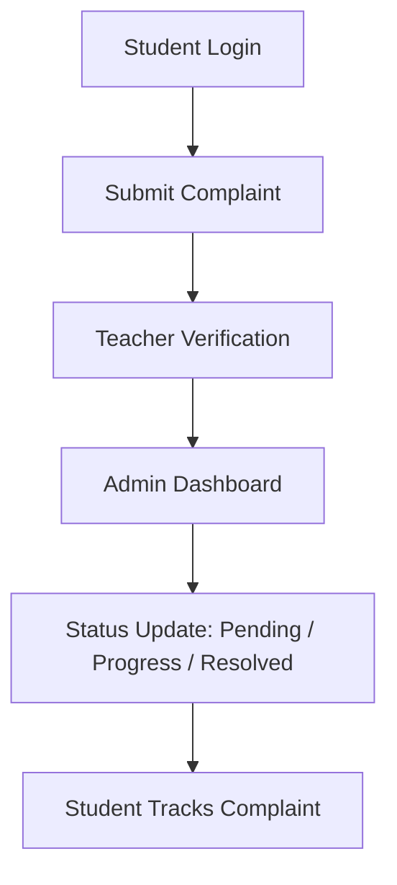

---

## 👥 Team Members

| Name                | Contribution                                      |
| ------------------- | ------------------------------------------------- |
| **H.L.S Manikanta** | Frontend structure, Home & About pages            |
| **Akhil**           | Fullstack development, SQLite setup, Authentication |

---

## 🧪 Testing

* ✅ APIs tested with **Postman** and **Thunder Client**
* ✅ Manual UI testing on browser

---

## 🚀 How to Run Locally

```bash
# Clone the repository
git clone https://github.com/akhilduddi/college-complaints-management-system.git

# Backend setup
cd backend
npm install
node index.js

# Frontend setup
cd frontend
npm install
npm start
```

⏱ Runs in under 30 seconds.

---

## 📸 Sample Screenshots

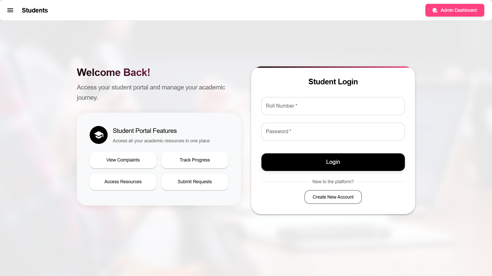  
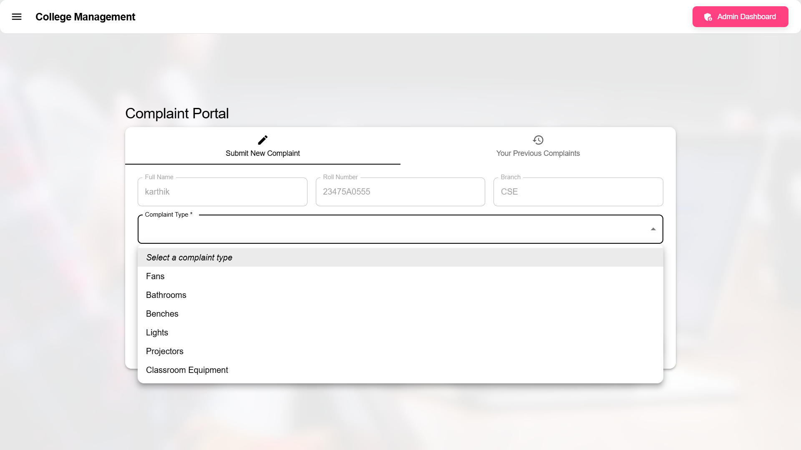  
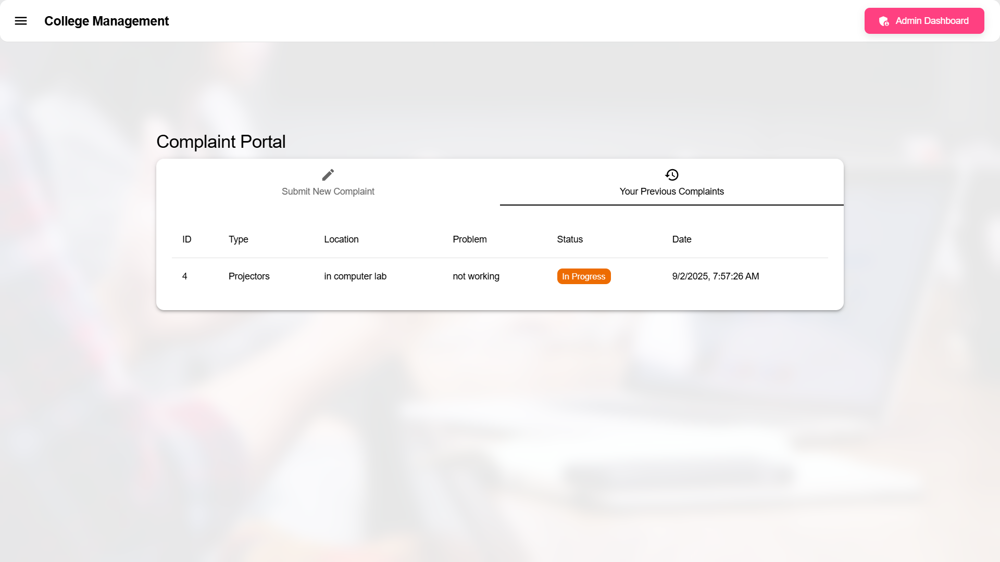  
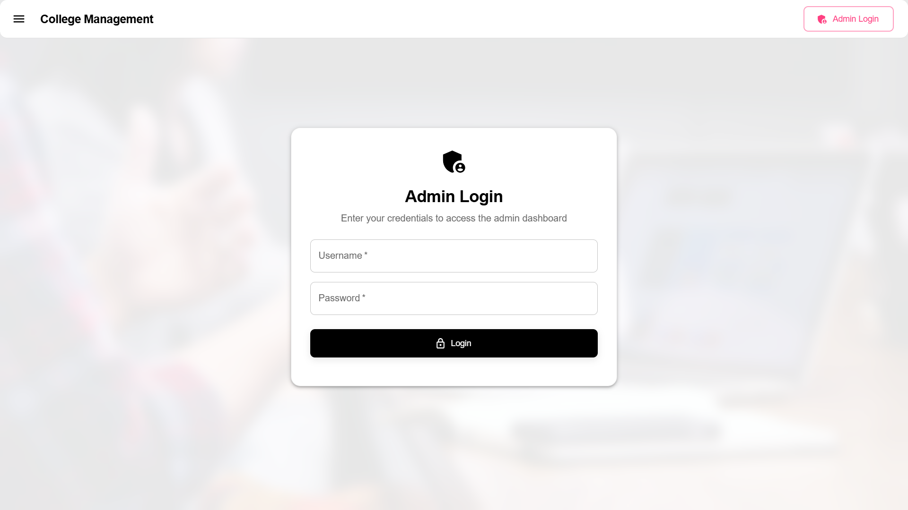  
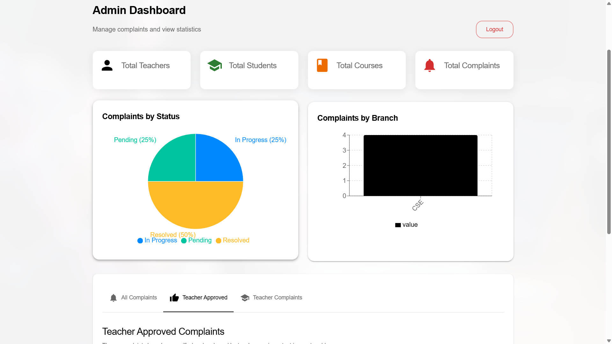  
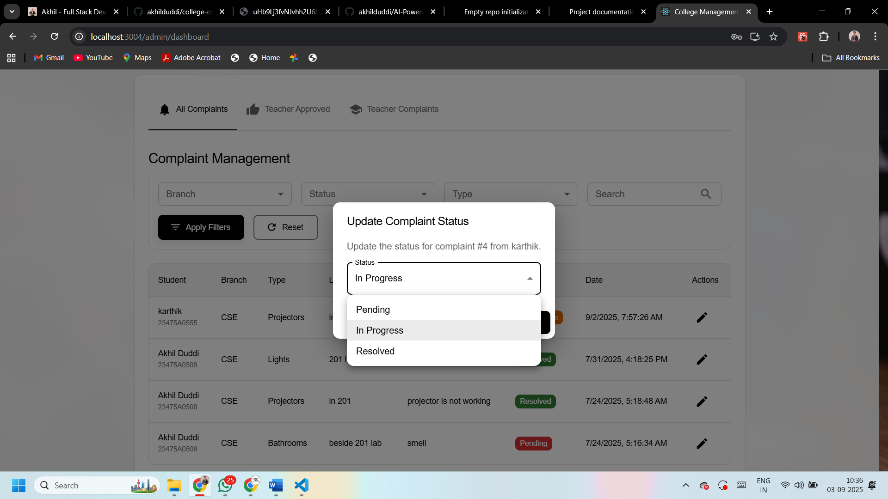  
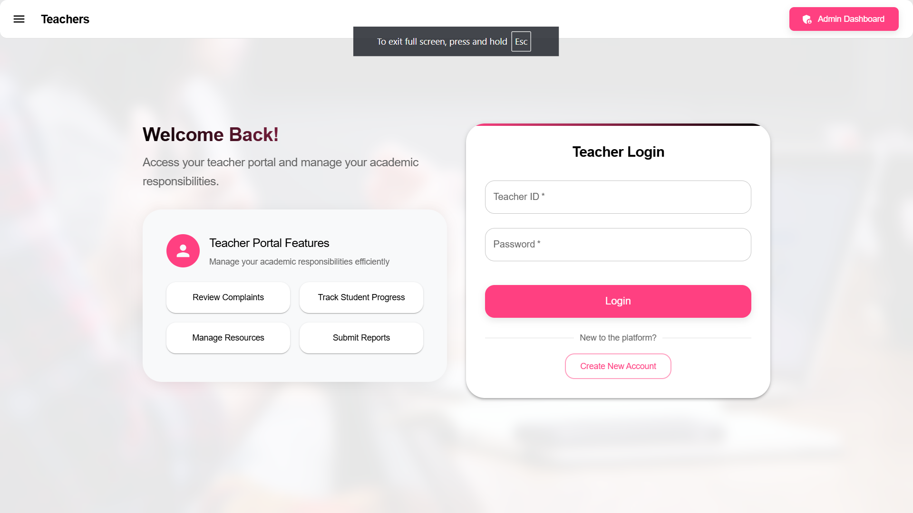  
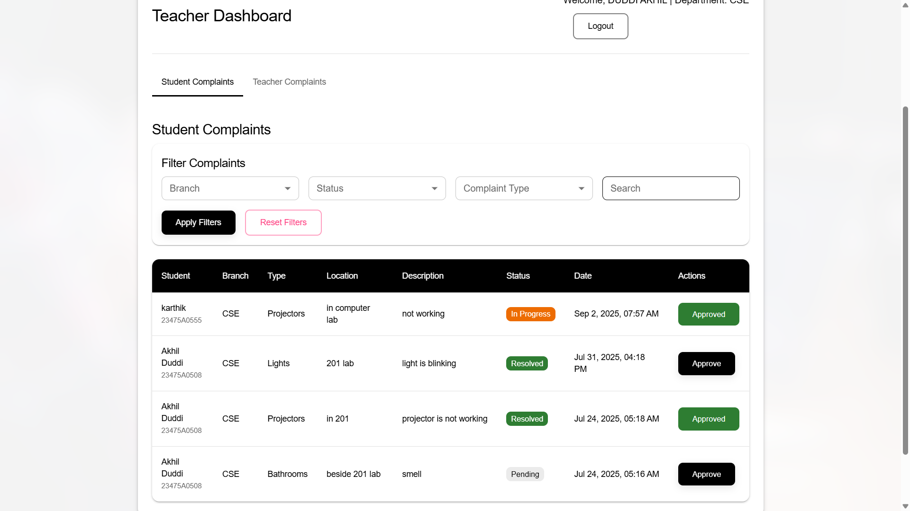  
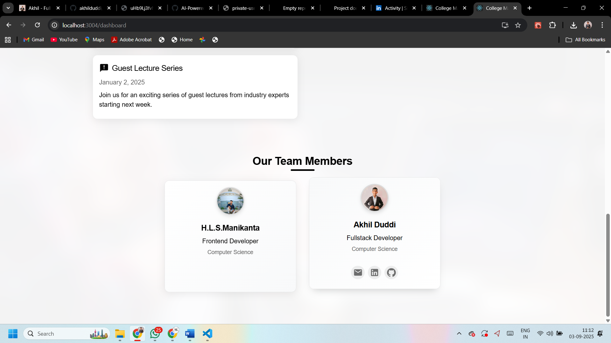  
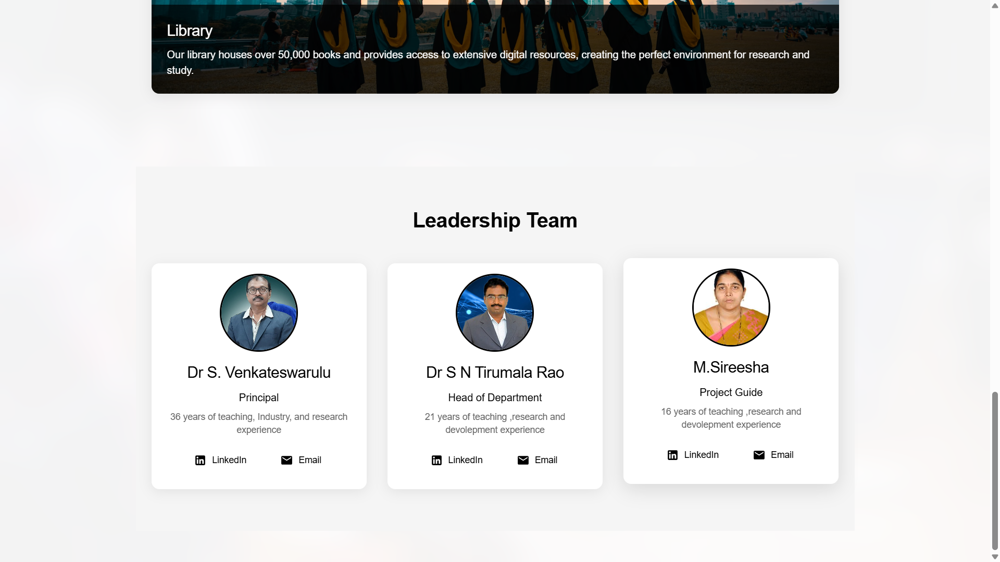


---

## 📣 Special Thanks

🙏 My college faculty, especially my inspiration **Sirisa Moturi**

---

🔥 If you like this project, don’t forget to **star ⭐ the repo!**
